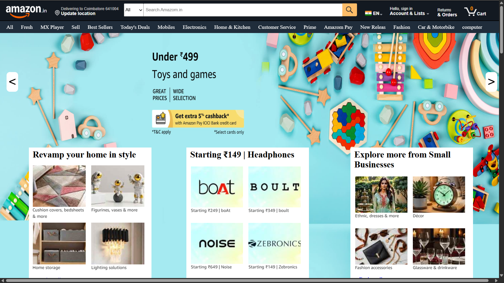
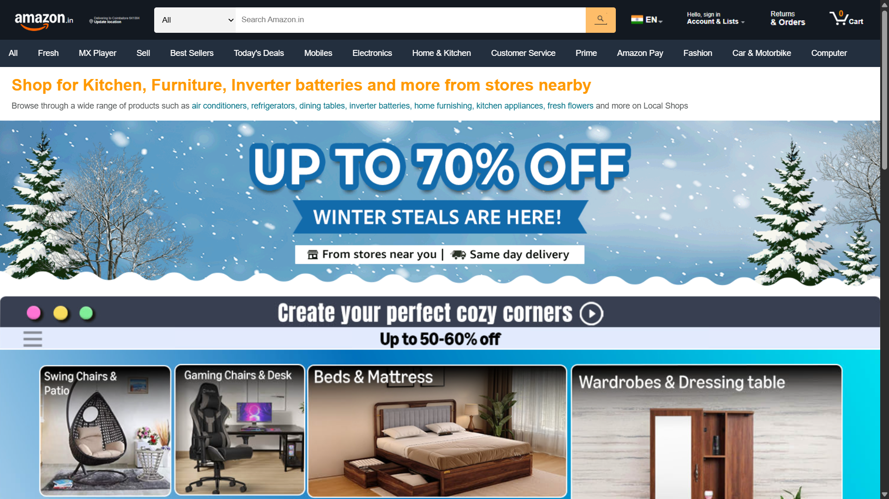
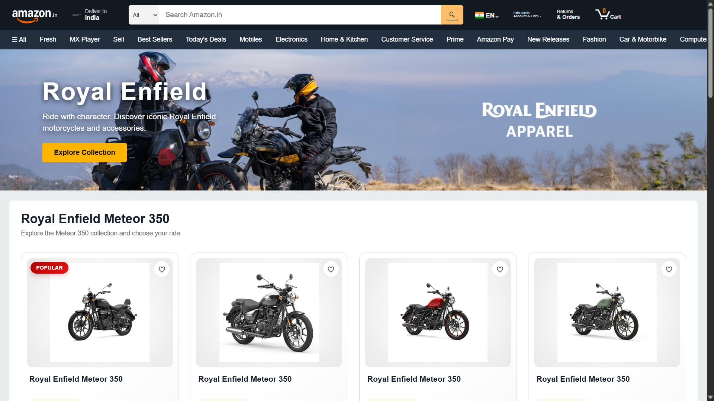

# 🛒 Amazon Clone Page
A responsive **Amazon-inspired e-commerce website** developed using **HTML, CSS, and JavaScript**.
This project recreates the look and feel of an online shopping platform with navigation, product sections, banners, and multiple product/category pages.

## 🚀 Live Demo
🌐 **Website:**

https://kishor165.github.io/Amazon_clone_page/

## 📸 Project Screenshots

### 🖥️ Page One
<p align="center">
  
</p>

### 🖥️ Page Two

<p align="center">
  
</p>

### 🖥️ Page Three

<p align="center">
  
</p>

## 🛠️ Technologies Used
* HTML5
* CSS3
* JavaScript

## ✨ Features

* Amazon-inspired user interface
* Responsive webpage design
* Navigation bar and search section
* Product and category sections
* Multiple product pages
* Interactive page navigation
* Clean and structured HTML/CSS
* Responsive layout for different screen sizes

## 📂 Project Structure
```text
Amazon_clone_page/
│
├── index.html
├── ktm.html
├── next.html
├── royal.html
├── triumph.html
│
├── pageone.png
├── pagetwo.png
├── pagethree.png
│
└── README.md
```

## 🎯 Purpose

This project was created for **study and educational purposes only** to practice and demonstrate frontend development skills, including webpage structure, responsive layouts, styling, navigation, and UI design.

## ⚠️ Disclaimer

This is a **student/learning project** and is intended for **study and educational purposes only**.

This project is **not affiliated with, sponsored by, or officially connected to Amazon**. Amazon and related trademarks, logos, and brand assets belong to their respective owners.

No commercial use is intended.

## 👨‍💻 Author

**Kishor Kumar**

* GitHub: https://github.com/Kishor165
* LinkedIn: https://linkedin.com/in/kishorkumar28
